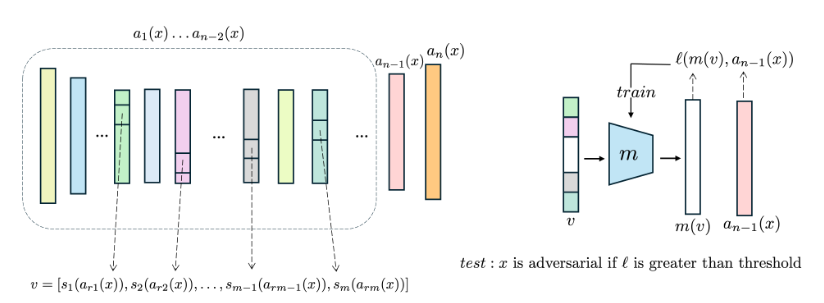

# Layer Regressin

[](https://openreview.net/forum?id=0CY5APFnFI)

Official implementation of the paper **"Universal and Efficient Detection of Adversarial Data through Nonuniform Impact on Network Layers"** (Transactions on Machine Learning Research, 2025).

Layer Regression (LR) is a lightweight defense method that detects adversarial attacks by monitoring the consistency between early-layer and deep-layer features.

* 🆕 **Update (December 6, 2025):** Code updated with **Automatic LR Training**. You can now simply provide a `timm` model name to train an LR detector. The script automatically handles layer selection and slicing, removing the need for manual configuration.

---

## 🚀 Key Highlights

- **Universal:** Compatible with any architecture (CNNs, Transformers) and domain (Image, Video, Audio).
- **Computationally Efficient:** Orders of magnitude faster than state-of-the-art detectors (e.g., EPS-AD, VLAD).
- **Real-Time:** Adds negligible latency (~0.0004s per sample), suitable for resource‑constrained systems.
- **Automated Setup:** Automatically discovers and selects optimal network layers for detection (Algorithm 1).

---

## 🛠️ Installation

```bash
git clone https://github.com/furkanmumcu/Layer-Regression.git
cd Layer-Regression
pip install torch torchvision timm numpy
```

[Download](https://drive.google.com/file/d/10FQEQ1yOT9Jtd7hESfDbYcT2cqa-Eg5t) and place the validation set of the 2012 ImageNet (ILSVRC 2012) in the directory `/dataset/imagenet/val`.

---

## ⚡ Quick Start

### **1. Training**

The training script is fully compatible with the timm PyTorch model library. By simply setting the model_name parameter, you can target any supported architecture. The code automatically analyzes the target model (e.g., ResNet, Inception, or ViT), selects the optimal layers using the methodology described in the paper, and trains the lightweight detector without manual intervention.

Run:

```bash
python lr_train.py
```

A checkpoint named `lr_detector_{model_name}.pt` will be saved under `lr-models` directory, containing both the model weights and the selected layer configuration.

---

### **2. Testing**

To evaluate the detector against adversarial attacks (using 5 sample images by default), run:

```bash
python lr_test.py
```

The testing script automatically loads the checkpoint saved during training and restores the exact layer configuration used, ensuring complete compatibility for evaluation.

---

## 🧠 Method Overview

<p align="center">

</p>

Deep Neural Networks (DNNs) process information sequentially. We hypothesize that adversarial perturbations, while imperceptible at the input, cause a "disconnect" that amplifies as features propagate through the network.

**Layer Regression** exploits this nonuniform impact using the pipeline illustrated above:

1. **Selection & Slicing:** We select a subset of early-to-mid layers (e.g., $a_{r1}, a_{r2}$) and apply slicing functions $s_i$ to extract the most informative feature segments.

2. **Vector Construction:** These slices are concatenated to form a single input vector $v = [s_1(a_{r1}(x)), \dots, s_m(a_{rm}(x))]$.

3. **Regression:** A lightweight model $m$ (MLP) is trained to map this vector $v$ to the target model's deep feature vector $a_{n-1}(x)$.

4. **Detection:**

   * **Training:** The model $m$ learns to minimize the error $\ell(m(v), a_{n-1}(x))$ on clean data.

   * **Inference:** Adversarial attacks distort deep features $a_{n-1}(x)$ significantly more than early features $v$. This causes the prediction error $\ell$ to spike, allowing us to flag any input where $\ell > \text{threshold}$ as adversarial.

LR requires no modification to the target model and no adversarial training.

---

## 📝 Citation

```bibtex
@article{mumcu2025universal,
  title={Universal and Efficient Detection of Adversarial Data through Nonuniform Impact on Network Layers},
  author={Mumcu, Furkan and Yilmaz, Yasin},
  journal={arXiv preprint arXiv:2506.20816},
  year={2025}
}

```


